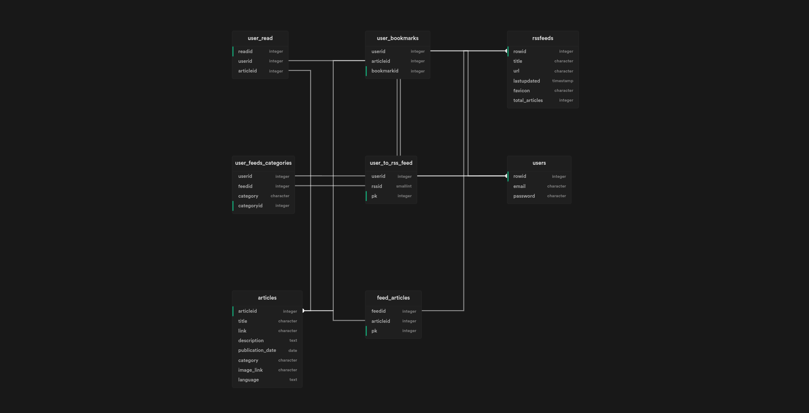

# Feedni

An Rss feed reader and content-aggregator. Inspired by Feedly.
[live demo](http://feedni.hasan.one/)

## Development

Run `yarn dev` to start development server.
This is a NextJS app so if you are not familiar with this framework check the NextJS docs.

The backend is devided into 3 layers:

1. The api endpoints: this layer only handles http requests. no data validation/processing.
2. The controller: this layer handles all data validation/processing.
3. The database (model): this layer handles querying the database. minimal data processing.

The frontend is your typical NextJS application.

The database schema looks like this:

